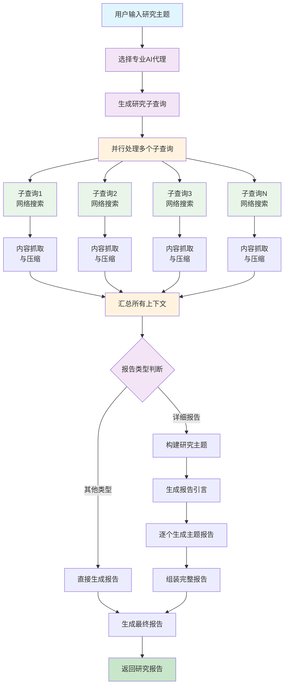

# 🔍 Lite Research

基于大语言模型的智能研究工具，旨在协助用户进行深入的主题研究和报告生成。

## 📖 项目背景

本项目基于 [gpt-researcher](https://github.com/assafelovic/gpt-researcher) 项目进行学习和实践。在研究其架构和实现逻辑的过程中，开发了这个简化版本。

Lite Research 保留了原项目的核心思想——通过AI代理进行智能化信息检索和报告生成，但在实现上进行了简化，去除了一些复杂的功能模块，使代码结构更加清晰易懂。

开发这个项目的主要目的是学习和实践AI驱动研究工具的架构设计，通过实际编码来深入理解此类系统的工作原理。

## ✨ 功能特色

- **🎯 智能代理选择**：根据研究主题自动选择合适的AI代理角色
- **🔍 子查询生成**：自动生成多个相关子查询，全面覆盖研究范围
- **⚡ 并行信息检索**：同时处理多个查询，高效获取网络信息
- **🧠 上下文压缩**：使用向量化技术提取最相关内容
- **📄 报告生成**：生成结构化的研究报告，支持多种类型和语气
- **📊 LLM监控**：集成 Langfuse 监控所有AI调用，提供详细的性能分析和成本追踪

## 🚀 快速开始

### 环境要求

- Python 3.8+
- 依赖包（见 `requirements.txt`）

### 安装步骤

1. **克隆项目**
   ```bash
   git clone https://github.com/i-richardwang/literesearch.git
   cd literesearch
   ```

2. **安装依赖**
   ```bash
   pip install -r requirements.txt
   ```

3. **配置环境变量**
   ```bash
   # 复制环境变量模板
   cp .env.example .env
   
   # 编辑 .env 文件，添加必要的API密钥
   ```

   **必要配置**：
   ```bash
   # LLM 配置
   OPENAI_API_KEY_DEEPSEEK=your_deepseek_api_key_here
   OPENAI_API_BASE_DEEPSEEK=https://api.deepseek.com/v1
   
   # 搜索配置
   TAVILY_API_KEY=your_tavily_api_key_here
   
   # 嵌入模型配置
   EMBEDDING_API_KEY=your_embedding_api_key_here
   EMBEDDING_API_BASE=https://api.example.com/v1/embeddings
   ```

   **可选配置 - Langfuse 监控**：
   ```bash
   # Langfuse 监控 (可选)
   LANGFUSE_SECRET_KEY=your_langfuse_secret_key_here
   LANGFUSE_PUBLIC_KEY=your_langfuse_public_key_here
   LANGFUSE_HOST=https://cloud.langfuse.com  # 可选，默认为云端版本
   ```

4. **启动应用**
   ```bash
   python run_app.py
   ```
   
   或直接使用 streamlit：
   ```bash
   streamlit run frontend/literesearch_app.py
   ```

### 使用方法

1. 在浏览器中打开 `http://localhost:8501`
2. 在输入框中输入您的研究主题
3. 选择报告类型和语气
4. 调整高级设置（可选）
5. 点击"开始研究"按钮
6. 等待AI生成研究报告
7. 下载Markdown格式的报告

## 📊 LLM 监控 (可选)

本项目集成了 Langfuse 来监控 LLM 调用。如需启用监控功能，请配置以下环境变量：

```bash
# Langfuse 监控 (可选)
LANGFUSE_SECRET_KEY=your_langfuse_secret_key_here
LANGFUSE_PUBLIC_KEY=your_langfuse_public_key_here
LANGFUSE_HOST=https://cloud.langfuse.com  # 可选，默认为云端版本
```

获取 API 密钥：访问 [Langfuse Cloud](https://cloud.langfuse.com) 创建项目并获取密钥。

**注意**：监控功能完全可选，不影响核心研究功能的使用。

## 📊 报告类型

- **📊 综合研究报告**：全面分析和总结
- **📚 资源汇总报告**：相关资料和参考文献列表
- **📝 研究大纲**：主要观点和结构框架
- **📋 详细深度报告**：全面且深入的分析
- **⚙️ 自定义报告**：根据特定需求定制
- **🔬 子主题报告**：特定子话题的深入分析

## 🎨 语气选择

- **正式**：学术和商业报告风格
- **非正式**：轻松易读的风格
- **分析性**：深度分析导向
- **说服性**：具有说服力的表达
- **信息性**：客观信息传递
- **解释性**：详细解释和说明

## ⚙️ 高级设置

- **最大子查询数量**：控制研究的广度（1-10）
- **最大子主题数**：控制详细报告的深度（1-10）
- **每查询最大结果数**：控制信息量（1-20）

## 🔄 后端执行逻辑



### 核心组件说明

- **专业代理选择**: 根据研究主题智能匹配最合适的AI专家角色（如金融分析师、技术专家等）
- **子查询生成**: 将主题分解为多个相关的搜索问题，确保研究的全面性
- **并行信息检索**: 同时处理多个子查询，提高研究效率
- **智能内容处理**: 自动抓取网页内容并使用向量化技术筛选最相关信息
- **报告生成**: 根据不同报告类型需求，生成结构化的专业研究报告

## 🛠️ 技术栈

- **前端**：Streamlit
- **后端**：Python, LangChain
- **AI模型**：OpenAI GPT系列
- **搜索引擎**：Tavily API
- **向量化**：OpenAI Embeddings
- **监控**：Langfuse (可选)

## 📁 项目结构

```
literesearch/
├── frontend/                 # 前端应用
│   ├── literesearch_app.py   # 主应用程序（核心功能逻辑）
│   ├── ui_components.py     # UI组件和样式定义
│   └── assets/             # 静态资源文件
├── backend/                 # 后端核心
│   └── literesearch/        # 文献研究模块
├── utils/                  # 工具函数
│   ├── llm_tools.py       # LLM工具类
│   └── langfuse_tools.py  # Langfuse监控工具
├── run_app.py             # 启动脚本
├── requirements.txt       # 依赖包列表
└── README.md             # 说明文档
```

### 🏗️ 代码架构

**模块化设计**：
- `literesearch_app.py`：核心功能逻辑，处理用户交互和AI研究流程
- `ui_components.py`：UI组件和样式，负责界面展示和用户体验
- 清晰的职责分离，便于维护和扩展

**核心功能模块**：
- 研究设置和参数配置
- AI研究流程控制
- 报告生成和下载
- 异常处理和用户反馈
- LLM调用监控和分析

## 🤝 贡献

欢迎提交 Issue 和 Pull Request 来改进项目！

### 开发指南

1. UI相关修改请编辑 `frontend/ui_components.py`
2. 功能逻辑修改请编辑 `frontend/literesearch_app.py`
3. 后端AI逻辑位于 `backend/literesearch/`
4. 监控工具位于 `utils/langfuse_tools.py`

## 📄 许可证

本项目采用 MIT 许可证。

## 📞 联系方式

- 作者：Richard Wang
- GitHub：https://github.com/i-richardwang/literesearch

---

**提示**：首次运行需要配置相应的API密钥，请确保 `.env` 文件中包含必要的配置信息。Langfuse 监控是可选功能，不影响核心研究功能的使用。